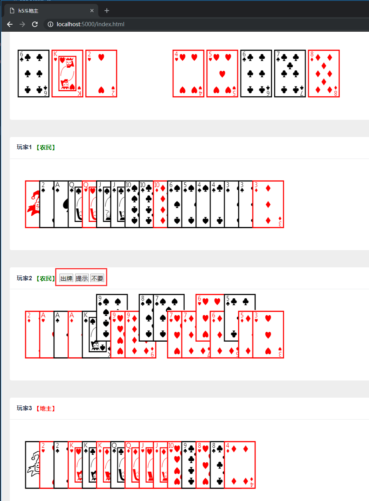

# .NETCore斗地主服务端 + HTML5前端

本项目最终目标为AI斗地主，机器人最优方案对打。

声明：本项目谥在学习，任何用于违法用途的行为与作者无关。

如果对本项目感兴趣，欢迎加入QQ讨论群：8578575

> 目前尚处于研阶段，为了方便测试，HTML5做成了单机方式运行，但这并不影响后期部署成多端游戏。

[【在线试玩】](http://52.197.199.192:8089/index.html?_blank)

# 环境依赖

* .NETCore 2.1
* chrome
* redis-server(本地环境)

# 已实现功能

* 洗牌
* 发牌
* 抢地主
* 斗地主（游戏环节）
* 提示出牌
* 游戏结束

# 待现实功能

* 超时机制设计（抢地主、斗地主）
* 牌型分析